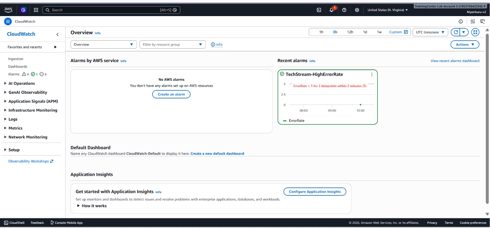
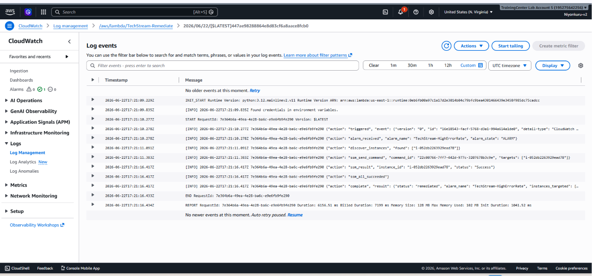
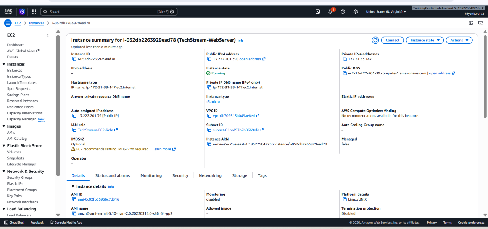
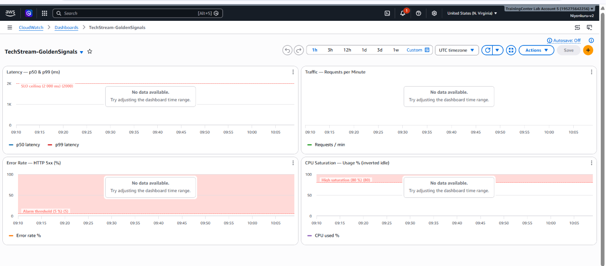

# TechStream Self-Healing Infrastructure

An AWS lab that demonstrates automated failure detection and remediation. When the Flask web server's error rate spikes above 5%, the system detects the anomaly, notifies operations, and automatically restores service — without any manual intervention.

---

## Architecture Overview

```
┌──────────────────────────────────────────────────────────────────┐
│                         AWS (us-east-1)                          │
│                                                                  │
│  ┌─────────────────┐   metrics/logs   ┌──────────────────────┐  │
│  │   EC2 / ASG     │ ────────────────▶│     CloudWatch       │  │
│  │  Flask :5000    │                  │  Metrics + Alarms    │  │
│  │  CW Agent       │                  └──────────┬───────────┘  │
│  └─────────────────┘                             │ ALARM state  │
│           ▲                                      ▼              │
│           │ SSM restart /            ┌──────────────────────┐  │
│           │ ASG scale-out            │     EventBridge      │  │
│           │                          └──────────┬───────────┘  │
│           │                                      │ invoke       │
│  ┌────────┴────────┐                  ┌──────────▼───────────┐  │
│  │  Auto Scaling   │◀────────────────│  Lambda: remediate   │  │
│  │    Group        │  fallback scale  │  (Python 3.12)       │  │
│  └─────────────────┘                  └──────────────────────┘  │
│                                                                  │
│  ┌─────────────────┐                  ┌──────────────────────┐  │
│  │  SNS Topic      │◀────────────────│   CloudWatch Alarm   │  │
│  │  (email alert)  │                  │  TechStream-         │  │
│  └─────────────────┘                  │  HighErrorRate       │  │
│                                       └──────────────────────┘  │
└──────────────────────────────────────────────────────────────────┘
```

---

## How Self-Healing Works

1. **Chaos injected** — `chaos.sh` fires concurrent HTTP requests against `/api`, which has a built-in 30% error rate. Error rate climbs above 5%.
2. **Alarm fires** — CloudWatch detects the breach across 2 consecutive 1-minute periods and transitions to `ALARM`.
3. **Notifications dispatched** — SNS publishes an email to the ops team. EventBridge routes the alarm event to Lambda.
4. **Primary remediation** — Lambda discovers EC2 instances tagged `Project=TechStream` and sends an SSM `systemctl restart techstream-app` command. Polls for success up to 90 seconds.
5. **Fallback remediation** — If the SSM restart fails, Lambda increments the ASG desired capacity by 1 (capped at 4 instances), overriding the cooldown period for an immediate response.
6. **Recovery confirmed** — Error rate drops, alarm returns to `OK`, and `verify.sh` validates all components.

---

## Project Structure

```
Self-Healing/
├── app.py                        # Flask web server (intentional bugs, /metrics endpoint)
├── remediate.py                  # Lambda function: SSM restart → ASG scale-out
├── alarm.tf                      # Terraform: CloudWatch Alarm, SNS, EventBridge, Lambda
├── userdata.sh                   # EC2 bootstrap script (Python, Flask, CW agent, systemd)
├── chaos.sh                      # Chaos injection: CPU stress or HTTP load
├── verify.sh                     # Smoke tests: app, agent, metrics, alarm, Lambda
├── devops-guru.sh                # Optional: AWS DevOps Guru anomaly detection
├── amazon-cloudwatch-agent.json  # CW agent config: metrics, logs, dimensions
├── dashboard.json                # CloudWatch dashboard: latency, traffic, errors, CPU
├── eventbridge-rule.json         # EventBridge rule pattern reference
└── lambda-role-policy.json       # IAM policy for Lambda execution role
```

---

## Key Components

### Flask Application (`app.py`)
| Endpoint  | Behaviour |
|-----------|-----------|
| `/health` | Always returns HTTP 200 — liveness probe |
| `/api`    | 30% error rate, 0.5–3 s random latency — intentionally buggy |
| `/metrics`| Prometheus-style exposition of request/error counters |

Emits structured JSON logs to `/var/log/app.log` for CloudWatch ingestion.

### CloudWatch Alarm (`alarm.tf`)
| Parameter | Value |
|-----------|-------|
| Metric query | `(errors_total / requests_total) × 100` |
| Threshold | > 5% |
| Evaluation periods | 2 consecutive 1-minute periods |
| Alarm actions | SNS (email) + EventBridge → Lambda |



### Lambda Remediation (`remediate.py`)
| Tier | Action |
|------|--------|
| Primary | SSM `systemctl restart techstream-app` on all tagged instances |
| Fallback | ASG `SetDesiredCapacity` += 1, `HonorCooldown=False` |



### CloudWatch Agent (`amazon-cloudwatch-agent.json`)
- **Namespace:** `TechStream/WebServer`
- **Metrics:** error rate, latency, request count, CPU, memory, disk
- **Interval:** 60 seconds
- **Logs:** `/var/log/app.log` → `/techstream/app`, `/var/log/messages` → `/techstream/system`

---

## Prerequisites

### AWS Account Permissions
Your IAM user/role needs access to: EC2, Auto Scaling, CloudWatch, Lambda, SSM, SNS, EventBridge, IAM, and optionally DevOps Guru.

### Local Tools
| Tool | Purpose |
|------|---------|
| Terraform ≥ 0.12 | Provision AWS resources |
| AWS CLI v2 | Interact with AWS services |
| `jq` | JSON parsing in shell scripts |
| `curl` | HTTP load testing in chaos.sh |
| Bash 4.x+ | Run all shell scripts |

---

## Setup & Deployment

### 1. Configure AWS credentials
```bash
aws configure
# Region: us-east-1
```

### 2. Deploy infrastructure
```bash
terraform init
terraform plan
terraform apply
```

### 3. Bootstrap EC2 instance
`userdata.sh` runs automatically on instance launch. It installs:
- Python 3.12 + Flask
- CloudWatch Agent (configured from `amazon-cloudwatch-agent.json`)
- A systemd service (`techstream-app`) with `Restart=on-failure`
- `stress-ng` for CPU chaos testing



### 4. Deploy the Lambda function
```bash
zip remediate.zip remediate.py
aws lambda update-function-code \
  --function-name TechStream-Remediate \
  --zip-file fileb://remediate.zip
```

### 5. Verify the setup
```bash
bash verify.sh
```
Checks: app health, CloudWatch agent, custom metrics, alarm config, Lambda logs, DevOps Guru (optional).

---

## Running a Chaos Experiment

```bash
# Inject HTTP load for 5 minutes (200 concurrent requests)
bash chaos.sh load http://<EC2-IP>:5000 200 300

# Inject CPU stress on 4 cores for 2 minutes
bash chaos.sh cpu 4 120

# Run both sequentially
bash chaos.sh both http://<EC2-IP>:5000
```

Watch the CloudWatch dashboard for the error rate to spike, the alarm to fire, and Lambda to restore the service automatically.

---

## Monitoring

Import `dashboard.json` into CloudWatch Dashboards to view:

| Widget | Metric | SLO line |
|--------|--------|----------|
| Latency | p50 & p99 (ms) | 2,000 ms |
| Traffic | Requests per minute | — |
| Error Rate | HTTP 5xx % | 5% alarm threshold |
| CPU Saturation | CPU used % | 80% high-saturation |



---

## IAM Permissions (Lambda)

The Lambda execution role (`lambda-role-policy.json`) follows least-privilege:

| Permission | Scope |
|------------|-------|
| `ec2:DescribeInstances` | Tag-filtered: `Project=TechStream` |
| `ssm:SendCommand` + `GetCommandInvocation` | Tag-filtered resources, `us-east-1` only |
| `autoscaling:DescribeAutoScalingGroups` + `SetDesiredCapacity` | TechStream ASG |
| `logs:CreateLogGroup/Stream/PutLogEvents` | Lambda log group only |

---

## Optional: AWS DevOps Guru

Enable intelligent anomaly detection on top of the base lab:

```bash
# Enable DevOps Guru on the CloudFormation stack
bash devops-guru.sh enable

# Run chaos, wait 15 minutes, then export insights
bash devops-guru.sh chaos-and-wait http://<EC2-IP>:5000

# Check current status
bash devops-guru.sh status
```

Insights are exported to `devops-guru-insights/` as JSON.

---

## Configuration Reference

| Setting | Default | Location |
|---------|---------|----------|
| Error rate | 30% | `app.py` → `ERROR_RATE` |
| Min latency | 0.5 s | `app.py` → `MIN_LATENCY_S` |
| Max latency | 3.0 s | `app.py` → `MAX_LATENCY_S` |
| Alarm threshold | 5% | `alarm.tf` |
| SSM timeout | 90 s | `remediate.py` |
| Max ASG scale-out | 4 instances | `remediate.py` → `MAX_SCALE_OUT` |
| Metrics interval | 60 s | `amazon-cloudwatch-agent.json` |
| AWS region | us-east-1 | All files |

---

## Tagging Strategy

All AWS resources carry two tags used for IAM scoping and Lambda instance discovery:

```
Project = TechStream
Lab     = SelfHealing
```

---

## License

This project is provided for educational purposes.
